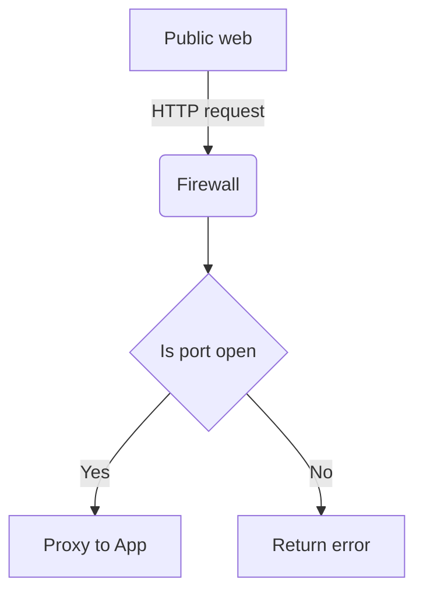
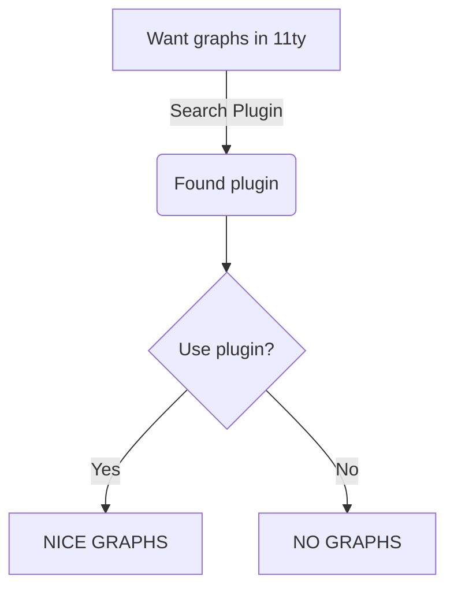
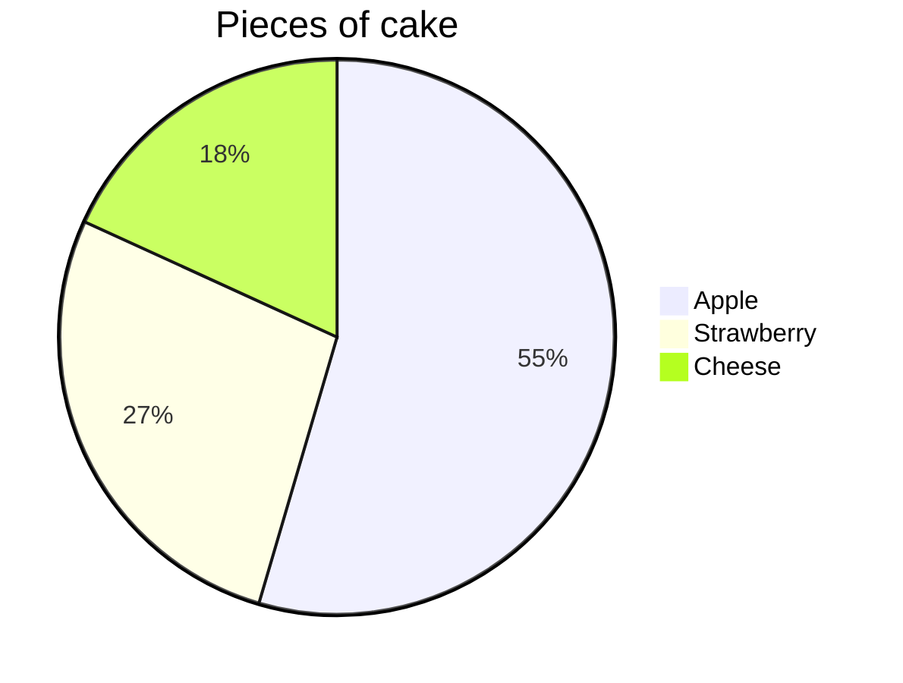
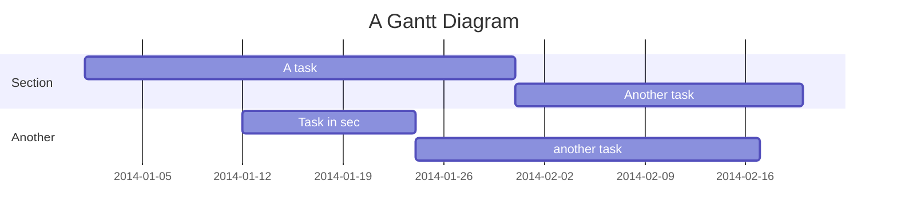

# Plugin Test Page

This page shows the `mermaid` integration in action!


## Default options



---



---





## Regular code

The graph above was rendered with mermaidJS using code like

```text
graph TD
A[Public web] -->|HTTP request| B(Firewall)
B --> C{Is port open}
C -->|Yes| D[App]
C -->|No| E[Return error]
```